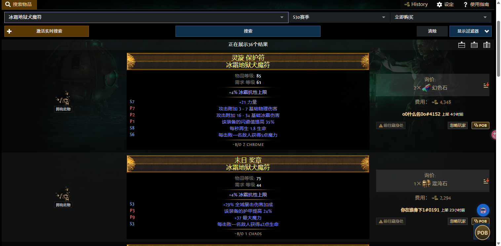
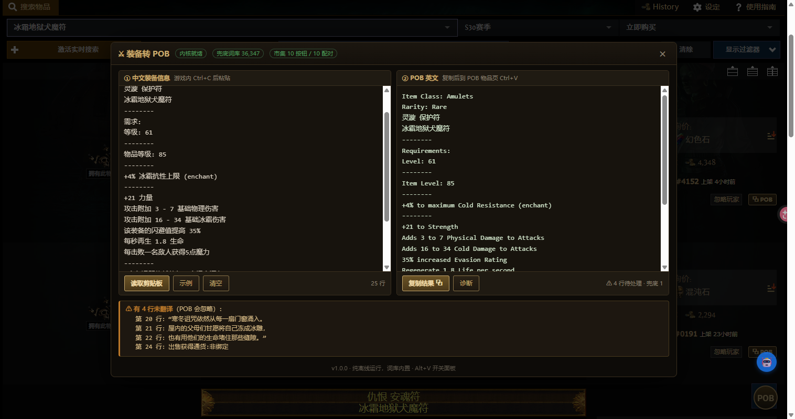

# POE1 装备转 POB（国服中译英）

国服《流放之路》装备信息一键转成 Path of Building 能识别的英文。**纯离线运行**，词库内置，不依赖任何服务器。

## 能做什么

**市集页面** — 每个搜索结果旁会出现 `⧉ POB` 按钮，点一下直接复制成英文，去 POB 的 Items 页 `Ctrl+V` 即可。

**游戏内复制** — 游戏里鼠标悬停装备按 `Ctrl+C`，切到浏览器按 `Alt+V` 打开面板，粘贴后自动转换。

左栏粘中文、右栏出英文，未翻译的行会单独列出来（POB 会忽略它们，不影响其余属性计算）。

## 安装

需要先装 [Tampermonkey](https://www.tampermonkey.net/)（Chrome / Edge / Firefox 都支持）。

然后点这个链接安装：

**[⬇ 安装脚本](https://raw.githubusercontent.com/gooyoy/poe-item-to-pob/main/poe-item-to-pob.user.js)**

> 脚本 5.3 MB，安装时会卡一两秒 —— 因为把完整词库（36,347 条）打包进去了，这样才能纯离线运行。装完是本地的，以后打开秒开。

### 如果点了没反应 / 一直跳转

这种情况是浏览器没把链接交给 Tampermonkey，而是自己去显示这个 5.3 MB 的文本文件了。用下面任一种方式都能装上：

**方式一 · 保存后导入**

右键上面的安装链接选「链接另存为」，存成 `poe-item-to-pob.user.js`。然后点浏览器里的 Tampermonkey 图标 → 管理面板 → 最右侧「实用工具」标签 → 在「导入」区域选择这个文件 → 点导入。

**方式二 · 从仓库文件页安装**

打开 [poe-item-to-pob.user.js](https://github.com/gooyoy/poe-item-to-pob/blob/main/poe-item-to-pob.user.js)，点右上角的 **Raw** 按钮，Tampermonkey 通常会直接弹出安装页。

安装后打开市集页面，右下角出现金色 POB 球就表示生效了。

## 为什么这么大

为了**完全离线**。市面上同类工具多数依赖在线接口，服务一停就用不了（`pob.mba/item` 等站点已失效）。这个脚本把翻译内核和词库全部内嵌：

| 组成 | 说明 |
| --- | --- |
| 翻译内核 | 处理装备结构、词缀分类、插槽连接 |
| 主词库 | 基底名、传奇名、词缀模板 |
| 兜底词库 | 36,347 条，覆盖冷门词缀 |

也正因体积超限，无法发布到 OpenUserJS（上限 1 MiB）和 GreasyFork（上限 2 MB）。

## 它怎么工作

**市集页** 拦截 `/api/trade/fetch/` 的响应拿原始 JSON，这比读页面文字准确得多 —— 插槽连接（`Sockets: G-G-R B`）、影响标记（`Shaper Item`）、词缀分类（`(implicit)` / `(crafted)` / `(enchant)`）都能准确还原。拿不到 JSON 时自动回退解析页面文字。

**配对物品**用「物品等级 + 名称/基底 + 词缀指纹」匹配，所以同名同基底的装备并排出现也不会认错。

**翻译**分三层：内核 → 人工规则补丁 → 兜底词库。修正了内核的若干缺陷，其中最关键的一个是：内核会把传奇物品名替换成 `Item`，导致 POB 认不出独有词缀、算错属性 —— 已通过 1309 个传奇的反查索引修复。

## 已知边界

游戏与市集的**新增词缀**可能未收录，未翻译的行会在面板里列出，POB 会忽略它们，不影响其余属性计算。

**市集 DOM 结构若大改**按钮可能不出现，此时按 `Alt+V` 用面板转换仍然可用。面板里的「诊断」按钮可生成结构信息便于反馈。

## 致谢

- 翻译内核 [cn-poe-translator](https://github.com/cn-poe-community/cn-poe-translator) — MIT
- 词库 [cn-poe-export-db](https://github.com/cn-poe-community/cn-poe-export-db) — 上游已归档，故本地化保存
- 兜底词库源 PoeCharm 汉化词典
- 按钮注入方案参考 [poe2-trade-pob](https://github.com/gogit2194/poe2-trade-pob)

## 许可

MIT
